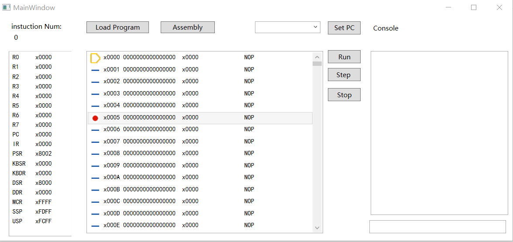

# LC3 Assembler and Simulator

Additional Lab for ICS 2019@USTC

## LC3 Assembler

LC3 Assembler in C++,  CLI

## LC3 Simulator

LC3 Simulator in WPF, C#,  GUI

Implement run, breakpoint, single step, jump to, console I/O, interrupt.

"Assembly" button can assembly `.asm `with previous assembler in C++.

